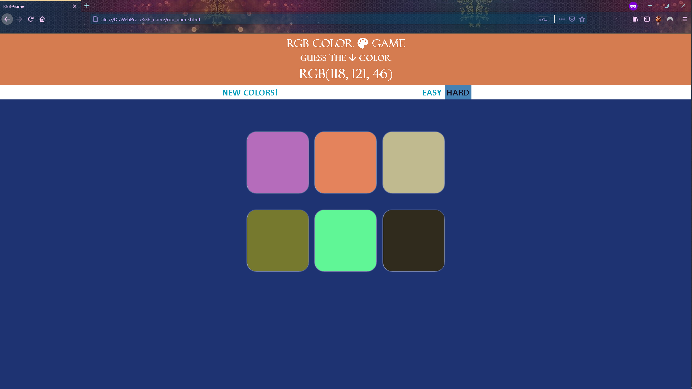
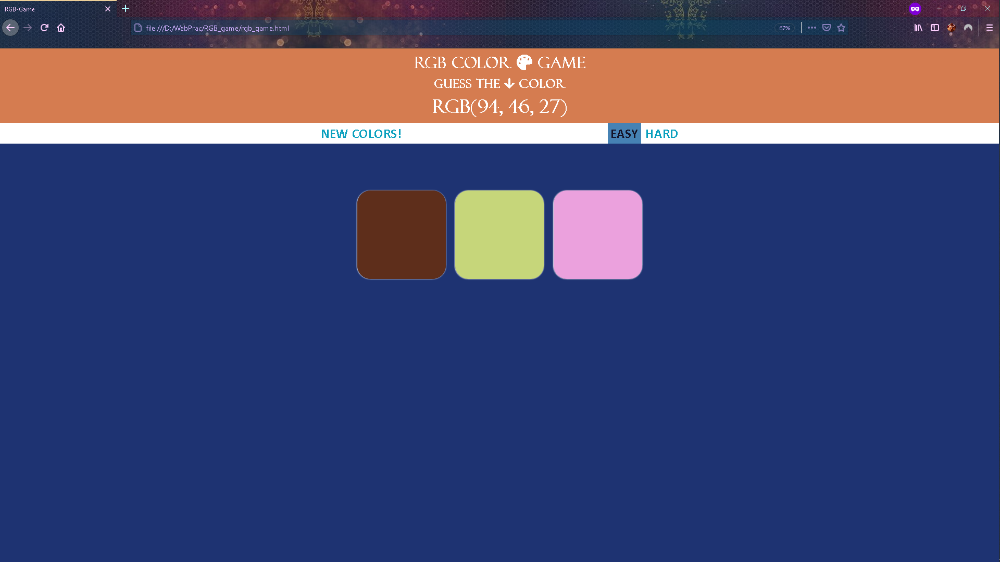
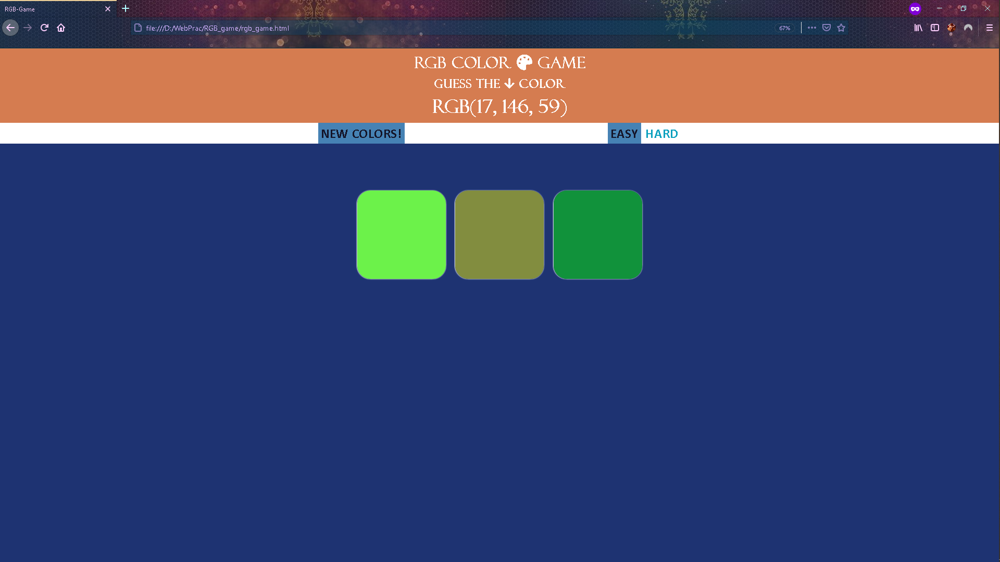
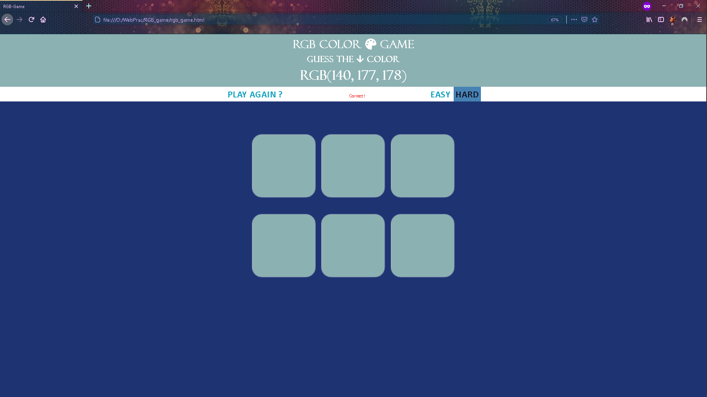

# --RGB _Color_ Guessing Game-- :art:

### _A Little Project using HTML, CSS and JavaScript_.

	Displays some random colors to guess from,
		   and a < RGB color code > .

Two Modes available: Easy & Hard
 

	You can Choose New Colors by clicking on `NEW COLORS!`

 
###### All colors turn same when you correctly guessed the given Color
 

>One of my very first projects  in learning Web Dev.
Do give your comments/suggestions. :memo:

**Thank You**
